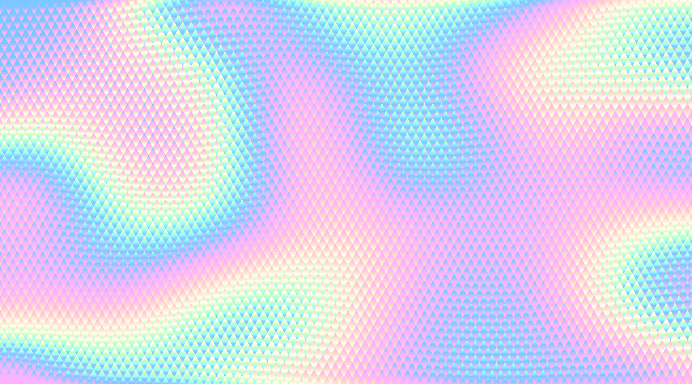

# Lumina DEX Interface

  

 

<h2 align="center">
  A protocol for decentralized exchange of Mina tokens
</h2>

 

- Website: [luminadex.com](https://luminadex.com/)
- Email: [contact@luminadex.com](mailto:contact@luminadex.com)

